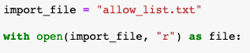
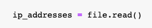
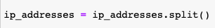
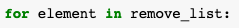
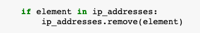
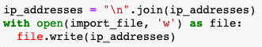

<h1>Algorithm for file updates in Python</h1>

<h2>Description</h2>
In this project, I am tasked to regularly update a file that identifies employees who can access restricted content. The contents of the file are based on who is working with personal patient records. Employees are restricted access based on their IP address. 
  
There is an allow list for IP addresses permitted to sign into the restricted subnetwork. 
There's also a remove list that identifies which employees you must remove from this allow list.
  
I will need to create an algorithm that uses Python code to check whether the allow list contains any IP addresses identified on the remove list. If so, the code will remove those IP addresses from the file containing the allow list.
 
 

<h2>Open the file that contains the allow list</h2>
The file containing the allow list is named <b><i>"allow_list.txt"</i></b> and will be assigned to the <b><i>import_file</i></b>  variable. I am going to use a <b><i>with</i></b> statement to initiate the <b><i>open()</i></b> function to read the file while utilizing another variable, named <b><i>file</i></b>, to store the file to be read:

 

<h2>Read the file contents</h2>
Using the <b><i>.read()</i></b>  method, I’ll convert the contents of the allow list file into a string, so we can read them. It will be stored the string in a variable called <b><i>ip_addresses</i>:</b>

 

<h2>Convert the string into a list</h2>
To remove individual IP addresses from the allow list, the IP addresses need to be in a list format. With the <b><i>.split()</i></b>  method, I’ll convert the <b><i>ip_addresses</i></b> string into a list:</b>

 

<h2>Iterate through the remove list</h2>
<b><i>remove_list</i></b>  is the second list that contains all of the IP addresses that should be removed from the <b><i>ip_addresses</i></b>  list. I will create a <b><i>for</i></b>  loop that will iterate through the <b><i>remove_list</i></b> and use <b><i>element</i></b> as the loop variable: 

 

<h2>Remove IP addresses that are on the remove list</h2>
In order to remove all the IP addresses from the allow list that are also on the remove list: 

- First, I’ll create a conditional that evaluates if the loop variable <b><i>element</i></b> is part of the <b><i>ip_addresses</i></b> list. 
- Then, within that conditional, apply the <b><i>.remove()</i></b> method to the <b><i>ip_addresses</i></b> list and remove the IP addresses identified in the loop variable <b><i>element</i>:</b>

 

<h2>Update the file with the revised list of IP addresses</h2>
<b><i>
</i></b>
Now with these IP addresses removed from the <b><i>ip_address</i></b> variable, I’ll complete the algorithm by updating the file with this revised list:

- First I’ll convert the <b><i>ip_addresses</i></b> list back into a string using the <b><i>.join()</i></b> method.
- Apply <b><i>.join()</i></b> to the string <b><i>"\n"</i></b> which separates elements in the file by placing them on a new line.
- Then, use another <b><i>with</i></b> statement and the <b><i>.write()</i></b> method to write over the file assigned to the <b><i>import_file</i></b> variable.  

 

<h2>Summary</h2>
Parsing files allows one to read and update the contents of a text file and Python helps in the development of algorithms that automate the parsing of such files while also keeping them up to date.
 
 
This was an example on how we can use Python to develop an algorithm that parses this text file of IP addresses and updates the file by removing the addresses that no longer have access to the restricted content.
